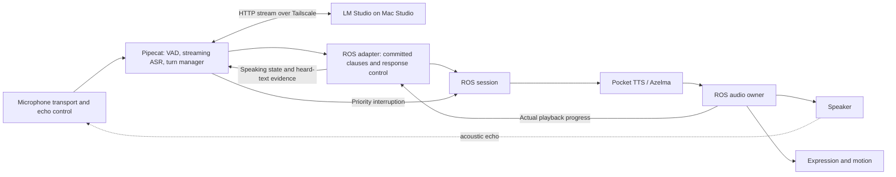

# ADR 0014: Pipecat conversation control with ROS speech execution

- Date: 2026-09-16
- Status: proposed architecture and staged delivery plan; not implemented or accepted
- Baseline inspected: `07fc60b`, with the existing local hardware/checkpoint notes preserved
- Scope: listen continuously, detect completed user turns, generate streamed replies through LM Studio, and stop an obsolete reply promptly when the user speaks again

## Recommendation

Run a persistent Pipecat conversation participant on `alice-brain`, with a custom
ROS adapter. Pipecat owns speech recognition coordination, turn decisions, LLM
context and streamed response text. Existing ROS components own speech synthesis,
audio playback, playback-derived expression and actuator admission. Keep the
Mac Studio as an HTTP inference endpoint; it does not join the ROS control clock.

Use local audio processing by default. The pending language preference determines
the recognizer/model evaluation corpus. English is the first proposed validation
profile, not an accepted product restriction. If Cantonese is required, evaluate
Cantonese and English/Cantonese code switching explicitly; a model labeled
Chinese or multilingual is insufficient evidence. Spoken output initially retains
the current Azelma voice; additional output languages require voice qualification.

Pipecat documents customizable frame processors, turn strategies and compatible
LLM endpoints. This is evidence that a custom adapter is feasible, not evidence
that our ROS integration already works. No built-in ROS transport was found in
the inspected official transport inventory. [Custom processors](https://docs.pipecat.ai/pipecat/fundamentals/custom-frame-processor),
[transport inventory](https://docs.pipecat.ai/pipecat/learn/transports).

## Alternatives considered

| Approach | Benefit | Cost and decision |
| --- | --- | --- |
| Pipecat conversation participant plus ROS adapter | Reuses turn strategies, streaming service integration and context infrastructure | Recommended. Must implement ROS playback feedback and cancellation integration. |
| Direct asyncio/rclpy pipeline with Silero, a recognizer and HTTP client | Fewer framework abstractions; precise control | Viable fallback if Pipecat dependency or adapter qualification fails; requires owning all turn/context/interruption behavior. |
| Pipecat owns TTS and speaker output, ROS receives expression events | A conventional Pipecat pipeline | Larger migration of existing DAC timing, mouth lookahead and cancellation evidence. Not selected for the first integration. |

Pipecat is a Python library; deployment does not require Pipecat Cloud, Daily,
or WebRTC. Those transports can be added later for a browser operator interface.
The initial robot path uses direct local ROS messages and HTTP to LM Studio.

## Current evidence and work to preserve

- `ros2_ws/src/alice_nodes/alice_nodes/session.py` already implements
  `/alice/run_speech` with `COMMITTED_CLAUSES` and subscribes to
  `/alice/run/committed_clauses`. Its first feedback establishes the authoritative
  epoch. External messages must match the requesting publisher incarnation.
- `SpeechClause` carries text, generation and clause identity, sequence, affect,
  intensity and seed. Current v1 uses a final flag on the last nonempty clause.
- `tts.py`, `audio.py` and `expression.py` already stream PCM and derive facial
  state from playback. Their simulated and speaker-only modes remain useful.
- Current session source completion is limited to 10 seconds; audio to 10 seconds
  including its tail; active execution to 25 seconds. Audio also waits at most
  5 seconds for its initial prebuffer. These are bench assumptions, not adequate
  definitions for an ongoing conversation.
- `TtsNode.prepare_run` synthesizes a warm-up phrase every response. Model state
  survives successful runs, but `PocketTtsWorker.cancel` terminates an active
  worker process and ROS cancellation cleanup closes the engine.
- Audio starts with 200 ms buffered PCM. The accepted jaw profile requires
  100 ms lookahead. The 300 ms response-end tail is not an inter-clause delay.
- The Docker runtime bridge is internal-only. Only the new conversation service
  needs an outbound route to the selected LM Studio endpoint.
- The XIAO USB connection is serial, not an ALSA sound card. Prior audio probes
  preload and retrieve buffers; they do not establish continuous duplex transport.
  The latest checkpoint records a temporary UART probe and speaker disconnection
  after reset noise. This plan does not change firmware or device state.
- The ROS hardware admission restriction and physical acceptance gaps remain.
  Initial implementation and qualification use simulated actuation.

See [ROS runbook](../ros2.md), [speech contracts](../../src/alice/contracts/speech_stream.py),
[audio evidence](../../hardware/respeaker-lite-audio-evidence-2026-09-16.md), and
[latest checkpoint](../../SESSION_CHECKPOINT.md).

## Proposed data flow and ownership

The conversation service runs an asyncio pipeline. A dedicated rclpy executor
thread communicates through bounded thread-safe queues and event notifications.
ROS callbacks never execute model inference or wait for HTTP. Control events
have a separate priority path from PCM/text queues. Model inference remains in
owned workers so blocking CPU work cannot delay detection or cancellation.

First qualify Pipecat in a separate image built against the existing ROS Python
3.14 environment. PyPI reported Pipecat 1.10.0, Python >=3.11, and a matching
ONNX Runtime 1.24.3 CPython 3.14 Linux wheel on the inspection date. This is only
package metadata, not full dependency or runtime qualification. Pin the exact
resolved image and packages; use documentation for that release. If dependencies
cannot coexist, isolate the Pipecat process behind a bounded local IPC bridge to
the ROS participant instead of replacing the robot's runtime dependencies.

Keep VAD and turn logic modular inside the conversation service initially.
Separate ROS processes for every audio analysis step are not required. The
audio input boundary publishes bounded PCM frames with sample rate, channel
selection, sequence, device incarnation and capture timing. Its adapter preserves
clock uncertainty rather than labeling packet arrival as exact capture time.

## Turn and recognition behavior

1. Capture continuously, including while Alice speaks. Keep a bounded pre-roll
   buffer; start qualification with 200 ms so speech onset is not clipped.
2. Run speech recognition during speech. Provisional transcripts can change;
   commit one finalized user message only after the turn decision. Do not trigger
   duplicate LLM calls for successive ASR revisions.
3. Use Silero VAD to identify speech/pause, and compare Pipecat Smart Turn against
   a configurable silence timeout. Start the experiment with the documented
   short VAD stop setting of 200 ms; measure the complete endpoint delay, including
   recognizer finalization and turn analysis. Do not stack independent silence
   timers accidentally. Silence and semantic turn completion are different.
4. Once a user turn is committed, start the LLM request using a persistent HTTP
   client. Keep the selected model resident and generation context bounded.
5. Convert streamed visible response text into short complete clauses. Start TTS
   as soon as a speakable clause is committed. Do not await the entire response,
   send individual tokens to Pocket TTS, or speak hidden reasoning/tool metadata.
6. On validated new speech onset, cancel the old response immediately while
   continuing to capture/transcribe the new user. Do not wait for silence, a final
   transcript, or an LLM decision to stop obsolete playback.

Pipecat offers VAD-based turn starts, configurable stop strategies and local
Smart Turn analysis. Its published settings are starting points to evaluate in
our room and required languages. [Turn strategies](https://docs.pipecat.ai/api-reference/server/utilities/turn-management/user-turn-strategies),
[Smart Turn](https://docs.pipecat.ai/api-reference/server/utilities/turn-detection/smart-turn-overview).

For local streaming ASR, evaluate a sherpa-onnx online recognizer selected for
the required languages. It needs a custom Pipecat service/processor adapter;
the online model catalog is not a claim of universal language coverage.
Use faster-whisper through Pipecat as a quality/reference baseline: the built-in
Whisper services process completed VAD segments, so they do not establish
continuous incremental recognition. If multilingual accuracy wins with Whisper,
evaluate an incremental wrapper or a local Mac recognition service separately,
including its extra contention with LM Studio. [Online recognizers](https://k2-fsa.github.io/sherpa/onnx/pretrained_models/online-transducer/index.html),
[Pipecat Whisper](https://docs.pipecat.ai/api-reference/server/services/stt/whisper).

## LLM and clause interface

Use Pipecat's compatible chat-completion client with base URL
`http://100.66.65.36:1234/v1`. The earlier read-only check found GPT-OSS 120B loaded;
generation latency, prompt behavior, streaming cancellation and model switching
have not been tested. Benchmark it against downloaded LFM2.5 1.2B and Qwen3 4B
2507 as candidate short-conversation models. Model size does not prove speed or
quality. Record reasoning settings, quantization, prompt length and concurrent
server load; choose using time to first usable clause plus answer quality.

The compatible API is documented by [Pipecat](https://docs.pipecat.ai/api-reference/server/services/llm/openai)
and [LM Studio](https://lmstudio.ai/docs/developer/openai-compat/chat-completions).

For the first smoke test, the adapter may buffer one final candidate clause to
use the existing v1 final flag. That is explicitly a temporary measurement
baseline. The conversational contract adds an independent response-end control
event so earlier clauses can be committed immediately and the final nonempty
clause need not be withheld waiting for completion. Preserve v1 fixture support.
Response end must remain ordered after all admitted clauses and complete TTS
drain exactly once. No empty/filler clause is inserted to manufacture termination.

Add explicit clause admission credits/acknowledgments. Bound pending text and
generated PCM separately. A full queue pauses upstream generation consumption
within a bounded limit; continued overload cancels the response. It never drops
or revises a committed clause silently. Backpressure must not block interruption.
Preserve original ROS commit timestamps; do not refresh aged messages at relay.
Remote LLM arrival and local ROS commit are distinct recorded events.

Begin with explicit neutral affect metadata. A later validated per-clause affect
policy can supply bounded cues without introducing a second blocking LLM call
before speech. LLM output never grants motor/device authority.

## Playback, interruption and context

Pipecat's normal interruption behavior cancels in-flight work and clears its own
output transport. It does not automatically flush our independent ROS queues.
The custom adapter must map interruption into the current ROS action/response
identity and propagate actual playback state back into Pipecat. [Interruption
semantics](https://docs.pipecat.ai/pipecat/fundamentals/interruptions).

Cancellation first invalidates the active generation at each receiving boundary
and flushes unplayed audio locally. It then cancels HTTP generation and TTS work,
retires expression/motion work and writes terminal evidence. These operations
must not wait for model teardown before silencing the speaker. Cancel requests
are idempotent and scoped to the admitted identity. If the user interrupts while
the action is still preparing, retain a cancellation latch and cancel the pending
action; publish no clauses before the authoritative epoch is known.

Keep listening during cleanup. A new reply is admitted only after the previous
response's playback ownership is retired. A stalled old model cannot block that
audio stop. A dead/replaced worker requires fresh identity and asset validation.

To avoid a cold reload after every interruption, qualify cooperative Pocket TTS
generation cancellation at chunk boundaries, with an explicit worker-ready
acknowledgment before reuse. A bounded failure falls back to terminating that
owned process and rebuilding/warming it. Retaining weights across cancellation
is an optimization to prove, not an existing guarantee.

ROS DAC/device feedback is the authority for when the bot starts/stops speaking
and how much output was heard. LLM completion is not speech completion. Feed
these receipts into Pipecat's speaking state and assistant context integration.
The current system lacks word-level alignment. Initially retain fully played
clauses and mark a partly played clause as interrupted/uncertain; exclude wholly
unplayed clauses. Do not claim an exact spoken prefix by proportional character
count. Exact word-prefix history requires a separately qualified aligner or TTS
word timestamps.

For gaps between LLM clauses, qualify explicit sample-counted silence with a
closed mouth and bounded no-progress timeout. Device underflow remains a fault.
Never relabel accidental starvation as successful playback. Finish the existing
release tail once per response; interruption does not wait for that tail.

## Audio transport and echo

Reliable interruption requires the microphone to distinguish the user from the
robot's speaker. VAD alone is insufficient. Qualify playback-reference routing,
AEC/echo suppression and simultaneous near-end/far-end speech using the actual
speaker, microphone placement, gain and transport.

First use replay or a verified host duplex audio route to qualify software.
For ReSpeaker, inspect the separate XMOS USB audio route as the first candidate
for a standard host audio interface; the current XIAO serial connection is not
that route. Any firmware/cabling experiment is a distinct hardware step. If
XIAO/Wi-Fi remains the chosen route, it needs framed continuous duplex streaming,
device sample counters, bounded jitter buffers, playback receipts, cancel/flush
acknowledgments and reconnect behavior. The reported Wi-Fi local-route issue
must be resolved in that qualification. Host network delivery is not DAC progress.

Retain the accepted 16 kHz I2S profile and digital cap as the starting hardware
evidence. TTS produces 24 kHz audio; any 16 kHz output route needs a stateful
streaming resampler and an explicit mapping between synthesis and device sample
positions. Preserve timing of mouth lookahead and AEC reference through it.

## Lifecycle and latency plan

Keep the conversation process, ASR, VAD, HTTP connection and verified TTS weights
warm. Separate long-lived service preparation from per-response admission.
Retain one response identity across all its clauses. Do not run a full
eight-participant preparation for every clause, or synthesize warm-up speech
repeatedly in the normal response path.

Introduce an explicit conversational profile with bounded per-turn budgets,
source progress timeouts and output limits. Preserve the bench profile and its
reviewed actuator restrictions. Change source/prebuffer/end deadlines through
tests for expected LLM pauses, rather than widening the 250 ms active control
freshness, DAC progress or fault bounds. A language-model wait is not an active
servo-control heartbeat. Long-lived readiness never grants continuous motion.

Only the conversation service receives the egress route needed for the selected
Tailscale endpoint. Demonstrate HTTP reachability from that container and continued
ROS discovery; a successful host curl is insufficient. Do not expose DDS across
Tailscale or change all services to host networking.

Instrument these points under one trace identity: acoustic speech end, detected
endpoint, final transcript, LLM request, first visible token, first committed
clause, first PCM, first DAC playback and audible response onset. Record cold,
warm and post-interruption cases separately. The prior motion-admission p99
does not measure conversational latency.

Initial engineering targets, subject to benchmark acceptance:

| Measurement | Initial target |
| --- | --- |
| End of user speech to first audible reply, warm short turns | p50 <= 1.0 s; p95 <= 1.5 s |
| Validated user-speech onset event to actual output silence | p95 <= 150 ms |
| Acoustic user-speech onset to actual output silence | p95 <= 250 ms |
| Adapter-only clause delivery, idle and loaded | p95 <= 20 ms |
| Obsolete-generation output after acknowledged cancellation | zero |

These are targets, not measurements or guaranteed performance. Endpointing,
residual ASR finalization, first speakable LLM clause, TTS and device buffering
contribute to latency, with some stages overlapping. Keep the current 200 ms
audio prebuffer initially; reduce it only with measured margin above the 100 ms
mouth lookahead. Benchmark under concurrent ASR/TTS load on the Ryzen 5 6600H.

## Staged delivery and acceptance

Every implementation stage begins with failure/replay tests. Keep fixture-driven
ROS behavior passing. Record configs, dependency/model hashes, seeds, metrics,
artifact manifest and conclusion. Store consented/raw speech outside the repository;
production raw-audio retention is off by default. Do not send microphone audio to
external providers without the user's preference authorizing that path.

### 1. Measure and establish a typed-response bridge

- Add isolated conversation dependency/image definitions and a device-free
  benchmark harness under `infra/conversation/` and `tests/conversation/`.
- Resolve the pinned Pipecat extras against the ROS image; test imports and
  a custom processor plus executor handoff. Add a proposed `conversation`
  executable under `ros2_ws/src/alice_nodes/` only after this passes.
- Use the existing action and v1 clause interface to stream a synthetic prompt's
  response through simulated playback. Exercise malformed text, empty completion,
  generation cancellation during preparation, server disconnect and slow tokens.
- Measure candidate LLMs, warm TTS first-PCM time, post-cancel reload and admission
  overhead. Capture model inventory and restore any benchmark-selected server
  model state as part of the eventual experiment procedure.
- Deliverable: reproducible real-LLM-to-ROS smoke test and latency breakdown,
  with no microphone/speaker/servo dependency.

### 2. Qualify continuous input and turn detection

- Define input PCM/clock/health contracts in `src/alice/contracts/` and the
  corresponding ROS interfaces; implement the input adapter under
  `ros2_ws/src/alice_nodes/` and analysis components under
  `src/alice/conversation/`.
- Integrate Silero/Smart Turn and a streaming recognizer behind explicit
  interfaces. Compare silence-timeout endpointing and segment-based Whisper.
- Replay pauses, hesitations, silence, noise, clipped first syllables, partial
  transcript revisions and the required language/code-switch corpus. Check
  bounded memory and continuous transcription while assistant audio is active.
- Qualify actual duplex input and echo reference separately. Test speaker only,
  user only and both speaking together; distinguish false interruptions from
  missed ones. Retain the current hardware checkpoint until that work is run.
- Deliverable: finalized user-turn events and interruption-onset events, with
  measured accuracy/latency and documented audio transport.

### 3. Make ROS response execution suitable for streaming conversation

- Extend `speech_stream.py`, ROS speech interfaces, `contracts.py`, `session.py`,
  `tts.py` and `audio.py` with ordered response-end events, admission credits
  and the conversational lifecycle/profile; preserve v1 fixtures.
- Tests cover end-before-last-clause, duplicate end, missing end, queue overflow,
  delayed source, deliberate silence versus underflow, repeated responses,
  worker restarts, readiness revocation and unchanged active-control guards.
- Separate warm preparation from per-response admission. Warm once per verified
  worker lifetime. Qualify cooperative TTS cancellation with forced-stop fallback.
- Deliverable: repeated and interrupted streamed responses without unnecessary
  model warm-up, unbounded queues, stale audio or altered bench restrictions.

### 4. Integrate Pipecat control and ROS playback feedback

- Implement separate modules for pipeline construction, LLM clauses, turn
  state and ROS playback/context adaptation under `src/alice/conversation/`.
  Keep the ROS executable responsible for transport/lifecycle only.
- Convert committed user turns into LLM requests and clauses; bridge Pipecat
  interruption into the admitted ROS response. Feed actual playback receipts
  back to bot-speaking and assistant-history state.
- Test interruption during LLM wait, clause generation, TTS, playback, end tail,
  preparation and terminal cleanup; repeated interruptions; late server/PCM
  packets; cancellation/complete races; loss of bridge/recognizer/transport.
- Confirm a new user turn is captured while old output is cancelled and that
  unheard generated text never appears as a fully spoken assistant response.
- Deliverable: continuous listen/respond/interrupt loop with simulated actuation.

### 5. Tune and qualify the complete conversation

- Use at least 100 short turns and 100 interruption trials per chosen profile;
  report p50/p95/p99/max, not just averages. Include idle and competing CPU load,
  network delay, ASR errors, echo, inter-clause stalls and a 30-minute soak.
- Tune endpoint thresholds, first-clause size, LLM reasoning/context, TTS warm
  behavior and buffering in that order according to the measured bottleneck.
  Never reduce lookahead/fault bounds solely to obtain a smaller headline number.
- Record false endpoint and false interruption rates on a held-out corpus. For
  a speaker-only control sample, target zero spurious interruptions in 10 minutes;
  report corpus limits rather than claiming general echo immunity.
- Qualify the selected speaker route and then any separately available physical
  expression integration. Verify actual acoustic stop time; HTTP cancellation
  acknowledgment and DAC submission are not acoustic silence evidence.
- Deliverable: accepted latency/quality report, pinned deployment, recovery/runbook
  instructions and an updated checkpoint naming remaining limitations.

## Review boundary

This document records a complete proposed architecture and delivery sequence.
No dependencies were installed, model switched, audio captured/played, firmware
changed or runtime behavior implemented during planning. Implementation should
begin with stage 1 after the design direction is accepted; exact recognizer
selection follows the language preference and measured evaluation.
