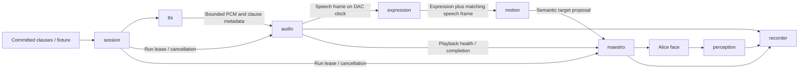

# Alice ROS 2 Docker runtime design

Date: 2026-09-15. Status: approved by the user on 2026-09-15; implementation in progress.

## Objective and scope

Run the existing speech, affect-driven expression, facial motion and robot-face
observation pipeline as separate ROS 2 nodes in Docker Compose. Retain the
tested Alice library behind ROS interfaces rather than rewriting its algorithms.
The first deployment targets the existing Linux amd64 robot host, with all
containers on that host. Cross-host audio/control synchronization is outside
this release.

The scope assumption is migration of the current pipeline. Live microphone
input, speech recognition and a provider-specific LLM conversation loop are a
separate extension. The input contract must continue to support incremental
committed clauses so that extension can replace the fixture source. No trained
emotion model or live LLM capability is implied by adding ROS nodes.

The working baseline is commit `28f71f4` in the preserved
`feature/streaming-affect-motion` worktree. Its checkpoint records 879 passing
tests, not a ROS qualification. Latest full-blink and closed-mouth sadness
tuning still awaits visible-motion acceptance. Preserve all prior artifacts.

## Platform and compatibility

Use ROS 2 **Lyrical Luth**, the latest stable release verified on 2026-09-15,
on the official Ubuntu 26.04 image. Lyrical is supported until May 2031.
Do not float deployments on the `latest` or Rolling tags.

Verified official base:

```text
ros:lyrical-ros-base-resolute@sha256:dbb2a254523ee3c40ec9fc07956bc1042253c7beb3b6dad4a4585d85c99e9716
```

The host reports Ubuntu 26.04.1 amd64, Docker 29.7.2 and Compose 5.5.0.
No host ROS installation is required. Use the image's system Python 3.14 for
`rclpy` and generated ROS interfaces; do not load its binary extensions into
the existing Python 3.13 environment.

The existing `pyproject.toml` requires Python `>=3.12,<3.14`. Python 3.14
qualification is the first implementation milestone, before changing that
constraint or refreshing the lock. Publisher metadata lists suitable candidate
Linux wheels for the pinned MediaPipe 1.0.1, Pocket TTS 3.1.0 and CPU Torch
2.14.0, including a CPython 3.14 CPU Torch wheel. Wheel availability does not
prove imports, model inference or sound-device compatibility. Test those in the
pinned image and retain the current dependency/model versions unless a concrete
failure requires a reviewed change. Do not silently downgrade ROS.

Separate lightweight runtime dependencies from optional perception/speech/ML
dependencies so the servo image does not load Torch or MediaPipe. Preserve the
legacy CLI installation path and document any extra needed by existing commands.

## Approaches considered

1. **Recommended: one Compose service per node, shared library.** Clear process
   and device ownership; independently testable transport boundaries; separate
   inference workloads from audio and serial callbacks. Adds serialization and
   message-loss handling, which must be measured.
2. One container launching all nodes as separate processes. Simpler packaging,
   but service restarts and device permissions are shared. Useful for development
   launch tests, not the intended deployment topology.
3. Rewrite the complete pipeline as ROS-specific implementations. Offers little
   immediate benefit and would duplicate already qualified trajectory, timing
   and fault logic. Not selected.

## Nodes and ownership

| Node / Compose service | Responsibility | Existing implementation to reuse |
| --- | --- | --- |
| `session` | Admit one response, validate committed clauses, coordinate prepare/start/cancel/completion, publish run state | `ClauseSequence`, orchestration extracted from `face_speech_cli` |
| `tts` | Warm offline Azelma synthesis; bounded, generation-scoped PCM delivery | `PocketTtsWorker`, model identities and worker deadlines |
| `audio` | PCM ring, speaker or simulated DAC, audible sample position, mouth envelope and speech ownership | `PcmTimeline`, `PcmRingBuffer`, playback classes |
| `expression` | Authored affect-to-expression policy, blink events and state continuation; explicit neutral learned fallback | `ExpressionBridge` and motion generator |
| `motion` | Combine the matching speech frame and expression proposal into semantic targets | `compose_frame` |
| `maestro` | Sole serial owner, final validation, selected-channel trajectory limits, watchdog and receipts | `FaceRuntime`, `FaceCommandStream`, `SafetySupervisor`, `MaestroFaceAdapter` |
| `perception` | C525 capture and robot-face blendshape observations, or replay fixtures | Camera identity checks, MediaPipe adapter and observation contracts |
| `recorder` | Collect run evidence and finalize a manifest, hashes and conclusions | Existing recording/artifact contracts |

The expression node uses the affect supplied with each clause. Robot-camera
blendshapes are observations of Alice, not inferred human emotion. Perception
remains an observer in this release; it does not introduce an unqualified
closed-loop correction to the servo stream.



All eight nodes are independently visible in the ROS graph. ROS launch files
also support hardware-free integration tests. Node callbacks hand off to bounded
workers; model inference, serial calls and file flushes do not run in the
PortAudio callback. Hardware validation remains inside the serial-owning
process, regardless of upstream node behavior.

## ROS contracts and transport

Create `alice_interfaces` for typed messages, services and actions. Do not use
unstructured JSON strings as the control-plane contract. ROS conversion checks
must retain existing schema identities, finite-number validation, calibration
hashes, channel names and source provenance.

Every active-run message carries a run ID, session incarnation and generation
ID. Every stream additionally has a monotonic sequence and source timestamp.
Restarting a node invalidates its prior run participation; old transient
messages cannot resume a previous run.

| Interface | Contract and delivery |
| --- | --- |
| `RunSpeech` action | Start a named mounted fixture or committed-clause source, expose progress, cancel, return outcome and artifact identity; one active run |
| `BeginRun` / `EndRun` services | Prepare validated configuration and generation; completion is distinct from cancellation and fault |
| `SpeechClause` | Existing immutable text, affect vector, intensity, seed, sequence and explicit response end; reliable, bounded queue |
| `PcmChunk` / `PcmCredit` | Mono float PCM with clause/sample identity and explicit end markers; credit-limited production, reliable bounded queue, sequence gaps fail |
| `SpeechState` | DAC sample index, rate, aperture with accepted lookahead, audible affect, ownership, playback status and original source time |
| `ExpressionFrame` | Original `SpeechState` plus the expression computed for that exact frame; latest-only delivery |
| `FaceTarget` | Composed semantic targets, originating speech sequence/sample/time and config identities; latest-only delivery |
| `RunHealth` / `PlaybackStatus` | Heartbeat, fault or successful drain, scoped to current incarnation; terminal outcomes acknowledged and idempotent |
| `ServoReceipt` / `FaceObservation` | Controller write/readback evidence or camera observations with separate timestamps and validity |

Use `rmw_fastrtps_cpp`, Lyrical's default, with an explicit UDP configuration for
container-to-container traffic and one dedicated project ROS domain. A private
Compose network is the initial deployment; qualify discovery and delivery on
that actual network. Do not depend on host IPC or shared-memory assumptions
across container namespaces. Do not expose application ports to the LAN by
default. Domain IDs and network separation are not authentication mechanisms.

Control samples use volatile, best-effort, keep-last-one delivery. The consumer
validates age and sequence; it never catches up by replaying stale commands.
Lifecycle requests and terminal outcomes use reliable delivery and bounded
application acknowledgements. Reliable DDS delivery alone is not completion
evidence. Deadline/liveliness notifications supplement local watchdogs.

PCM delivery uses chunks of at most 20 ms, a finite DDS history and explicit
sample credits tied to the audio ring's available capacity. Count in-flight
samples against credits; acknowledgements are cumulative and generation-scoped.
Keep the existing two-second audio ring and 200 ms startup target. Bound clause
and worker queues, reject missing/reordered PCM, and cancel blocked producers
without waiting indefinitely for consumers. A full queue backpressures synthesis;
it must not cause silent loss or unbounded memory growth.

## Timing, synchronization and fault behavior

The audio node is the authority for *audible* progress. Generated, queued,
submitted and DAC-played sample positions remain different measurements.
The speech frame already contains the current audible affect and mouth aperture
with 100 ms lookahead. The expression node carries that same frame through to
motion so mismatched expression/audio messages cannot be joined by arrival time.

All participating processes use the same host `CLOCK_MONOTONIC` domain. Verify
that assumption at startup; differing clock domains or time namespaces reject
hardware mode. Wall time and ROS simulation time are never hardware watchdog
clocks. Preserve the original audio source time through every hop, including
inference; reception must not refresh a stale proposal's age.

Retain the 250 ms source/progress/gap ceilings and per-write trajectory checks.
Record transport age separately: target a 99th-percentile audio-frame-to-servo
admission age below 20 ms in the same-host benchmark. This is a migration
acceptance target, not existing evidence or a reason to widen the watchdog.
Measure the actual end-to-end lip/audio relationship again before accepting
physical timing. Preserve the 100 ms configured mouth lead for that comparison.

The audio and Maestro nodes independently monitor the session lease and each
other's current-run health. Health during playback includes actual sample or
serial progress; an alive heartbeat thread cannot conceal a stalled worker.
Warm the TTS model before arming the hardware, and bound any subsequent wait
inside the existing run deadlines. A crash, stale lease, callback underflow or controller
fault revokes the run locally; a separate recorder or supervisor is not required
to make the local stop effective. Best-effort fault notification accelerates
sibling cancellation, while local expiry bounds a lost notification. Cross-node
stops are not claimed to be as immediate as the old shared `Event`; demonstrate
their latency with process-kill and message-loss tests.

When the Maestro process itself is killed, no software in that process can run
cleanup. The controller may retain its last PWM output. Report this explicitly;
container restart policies are not an emergency stop or servo-power cutoff.
Hardware services never automatically restart into an armed state.

Successful completion requires validated end-of-response, complete PCM drain,
and matching current-run playback success. A terminal zero-weight speech frame
alone does not authorize Home. A successful final sad clause may request the
existing bounded post-speech pose, followed by Home and jaw restoration. Fault
or cancellation bypasses these recovery writes. Conflicting or late completion
messages cannot override a latched fault. Retain the 25-second attended face-run
limit, ten-second audio limit, two-second maximum sad hold and six-second pose
deadline; continuous or longer hardware operation needs its own qualification.

The Maestro scope remains channels 6, 3, 4, 5, 9 and 11. Preserve controller
identity/error checks, exclusive ownership, calibration checksum, per-channel
limits, runtime jaw 0/0 and successful Home restoration to 0/11. Forehead remains
neutral. Gaze and head channels are not enabled by this migration.

## Docker project layout and operation

Proposed new paths:

```text
ros2_ws/src/alice_interfaces/   # messages, services, actions; ament_cmake
ros2_ws/src/alice_nodes/        # thin Python node adapters; ament_python
ros2_ws/src/alice_bringup/      # launch files and reviewed runtime parameters
infra/ros2/Dockerfile           # pinned core, speech, perception and test targets
infra/ros2/compose.yaml         # hardware-free replay/simulation default
infra/ros2/compose.audio.yaml   # speaker access, simulated servos
infra/ros2/compose.hardware.yaml # named serial/C525/audio access
infra/ros2/.env.example         # documented non-secret paths and IDs
docs/ros2.md                   # build, run, inspect, stop and qualification guide
tests/ros2/                    # contract, launch, transport and fault tests
```

Use a repository-root `.dockerignore` allowlist for `src`, `ros2_ws`, `infra/ros2`,
reviewed `config` and `hardware` files, tests and dependency/build metadata. Keep
`.git`, worktrees, caches, artifacts, credentials and model weights out of image
build contexts. Package runtime configuration and hardware manifests explicitly;
installed code must not infer repository paths from `__file__` parents.

Default Compose starts a synthetic/replay pipeline with simulated audio and
servos and no devices. The speech image supports real offline Azelma synthesis
through a mounted model cache. Audio and hardware overlays are explicit; startup
never moves servos merely because devices exist. A hardware run still requires
an explicit attended run request within the configured scope.

Only `maestro` receives the configured stable serial device. Only `perception`
receives the C525 video node. Only `audio` receives the selected sound-device
access. Resolve stable paths and verify controller/camera USB identities inside
the deployment, with read-only device metadata where needed. Do not grant
privileged mode, broad `/dev` access, or the Docker socket. Run as a non-root
user with the required numeric device groups, read-only config/model mounts,
dropped capabilities and a writable run-artifact volume. Qualify the host's
actual speaker route before choosing direct ALSA or its existing audio-server
socket; that does not alter node interfaces.

Set the runtime Compose network to `internal: true`; dependency downloads belong
to image builds or a separate explicit cache-provisioning command. All runtime
services, including optional diagnostics, join that same isolated ROS network.
Images contain versioned code and dependency locks. Models are checksum-verified
assets in an explicit cache, not downloads at run startup. Separate build-time
dependency networking from offline runtime behavior. Record the built image
digest, ROS package versions, model hashes and configuration hashes per run.

The recorder collects derived observations and execution evidence by default.
Raw frames, audio retention and broad rosbag recording require explicit run
configuration; preserve the existing provenance/retention rules. Local bounded
audio/servo logs remain available if the recorder fails. A run with incomplete
evidence cannot be published as a fully qualified experiment. Hash manifests
distinguish simulation, controller PWM evidence and measured physical behavior.

## Qualification and migration order

1. Qualify Python 3.14 and the pinned dependency/model set inside Lyrical. Run
   existing tests and offline inference smoke tests; retain Python 3.13 baseline
   evidence. Record actual failures before changing dependencies.
2. Add typed ROS contracts and library conversion tests, then bring up all nodes
   with deterministic synthetic PCM, replay perception and simulated servos.
   Assert graph topology, successful completion and no device access.
3. Qualify bounded transport and failure handling: duplicate/stale generations,
   source sequence gaps, delayed expression computation, full PCM queues, lost
   heartbeats, underflow, controller errors, cancellation during sad hold,
   recorder failure, and node restarts. Late completion must not revive a fault.
4. Run real offline Azelma TTS with a simulated DAC; compare sample accounting,
   policy identity and trajectory invariants against the existing CLI. Then
   qualify speaker output with simulated servos and record transport latency.
5. After the existing servo-power/visible-motion issue is resolved, perform an
   attended containerized test of the same selected channels and C525 observer.
   Judge mouth timing, full closure and final sadness from camera/operator
   evidence separately from controller completion.
6. Publish build/run instructions, an ADR recording the accepted design and an
   experiment report with retained manifests. Update the session checkpoint.
   Preserve the original CLI as a comparison and rollback path.

This design does not claim an image build, ROS graph test or new hardware trial
has passed. The next step after design approval is a concrete implementation
plan with tests written before behavior changes.

## Sources checked

- [ROS distribution list](https://github.com/ros2/ros2_documentation/blob/rolling/source/Releases.rst)
- [Lyrical release and support](https://github.com/ros2/ros2_documentation/blob/rolling/source/Get-Started/Releases/Release-Lyrical-Luth.rst)
- [Lyrical platform and Python requirements](https://raw.githubusercontent.com/ros2/ros2_documentation/rolling/source/Releases/lyrical/supported-platforms.rst)
- [Official ROS image manifest](https://raw.githubusercontent.com/docker-library/official-images/master/library/ros)
- [Official Lyrical Dockerfile](https://raw.githubusercontent.com/osrf/docker_images/master/ros/lyrical/ubuntu/resolute/ros-base/Dockerfile)
- [MediaPipe 1.0.1 publisher metadata](https://pypi.org/pypi/mediapipe/1.0.1/json)
- [Pocket TTS 3.1.0 publisher metadata](https://pypi.org/pypi/pocket-tts/3.1.0/json)
- [CPU Torch wheel index](https://download.pytorch.org/whl/cpu/torch/)

Local evidence: `SESSION_CHECKPOINT.md`, ADRs 0001/0010/0011, `pyproject.toml`,
`uv.lock`, existing node-candidate modules, host version output and
`docker buildx imagetools inspect ros:lyrical-ros-base-resolute`.
